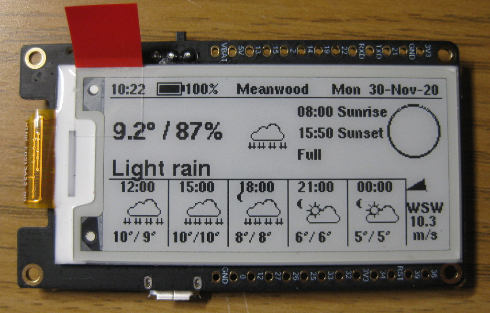

# Lilygo TTGO T5 2.13" ESP32 ePaper board

This directory contains the port to the
[LILYGO TTGO T5 V2.3 2.13](http://www.lilygo.cn/prod_view.aspx?TypeId=50031&Id=1149&FId=t3:50031:3)
board, which incorporates an ESP32 and a 2.13" 250x122 e-ink display.

The T5 board is known to have had three different screen revisions, as detailed
[on this github page](https://github.com/lewisxhe/TTGO-EPaper-Series#note).
This port uses the latest recommended screen driver, `GxGDE0213B72B.h`.

This port was built using the Arduinio IDE, with the following settings for the board:

  - Board: TTGO T1
  - Upload speed: 921600
  - CPU Frequency: 240MHz
  - Flash frequency: 40MHz
  - Flash mode: DIO
  - Flash size: 4MB
