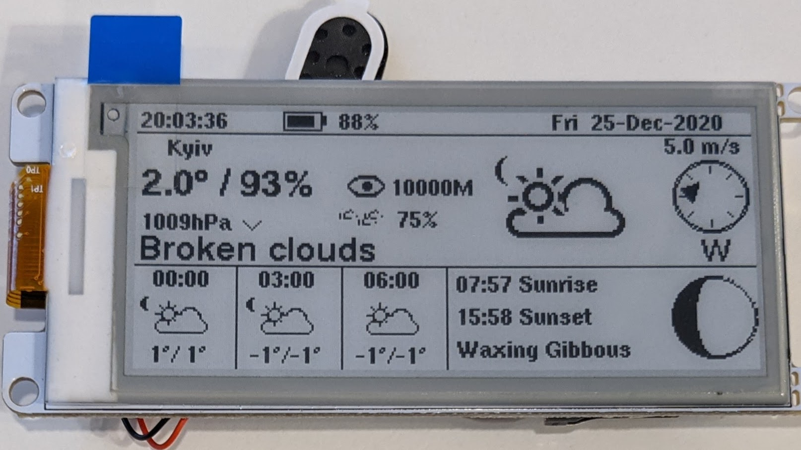

# Lilygo TTGO T5 2.9" ESP32 ePaper board

This directory contains the port to the
[LILYGO TTGO T5 V2.2 2.9](www.lilygo.cn/prod_view.aspx?TypeId=50031&Id=1146&FId=t3:50031:3)
board, which incorporates an ESP32 and a 2.9" 250x122 e-ink display.

This port was built using the Arduinio IDE, with the following settings for the board:

  - Board: TTGO T1
  - Upload speed: 921600
  - CPU Frequency: 240MHz
  - Flash frequency: 80MHz
  - Flash mode: QIO
  - Flash size: 4MB
