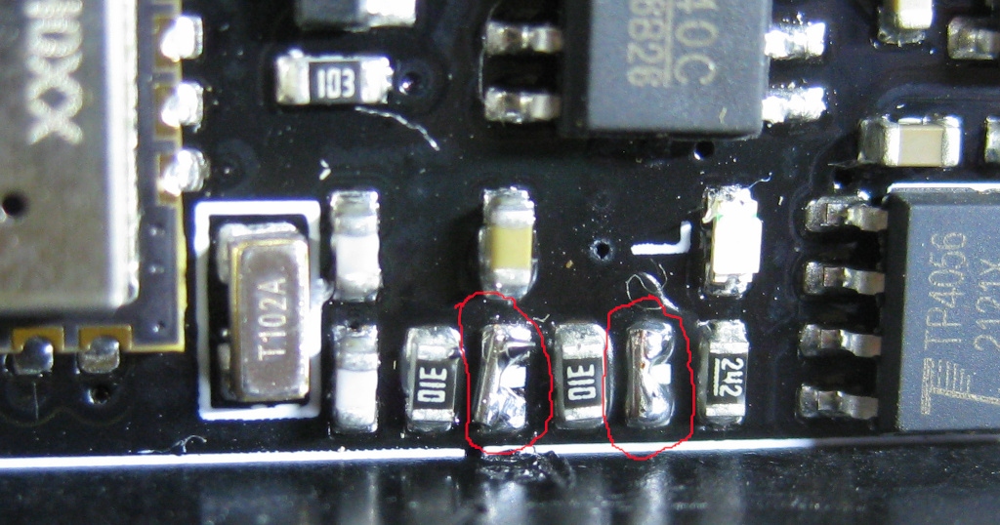

# Waveshare Pi Pico 3.7" wired to FireBeetle

This example is for a
[Waveshare Pi Pico 3.7" display](https://www.waveshare.com/pico-epaper-3.7.htm) connected
to a [DFRobot FireBeetle board](https://www.dfrobot.com/product-1590.html).

The display is formally known as *SKU: 20123*, *Part Number: Pico-ePaper-3.7*.

Although the display is designed to operate directly with a
[Pi Pico](https://www.raspberrypi.com/products/raspberry-pi-pico/), the Pi Pico
has neither native WiFi support nor super low power modes. The FireBeetle has both.

## Wiring

The below table shows the wiring used in the example. The FireBeetle is wired to the
Pi Pico header pins on the display. These details can also be found near
the top of the code.

It should be possible to use the alternative H1 SPI connector on the display board, but I
didn't have an appropriate plug to try.

The display is wired to SPI0, but uses different pins for the extra control lines than the
normal Lolin D32 examples in this repository, as some of the normal pins are nominally already
assigned other tasks on the FireBeetle.

| Function | Display pin | Firebeetle GPIO |
| -------- | ----------- | --------------- |
| BUSY     | 17          | D2 (IO25)       |
| RST      | 16          | D3 (IO26)       |
| DC       | 11          | D4 (IO27)       |
| CS       | 12          | D8 (IO5)        |
| CLK      | 14          | IO18 (SCK)      |
| DIN      | 15          | IO23 (MOSI)     |
| GND      | 13          | GND             |
| VSYS     | 39 (VSYS)   | VCC             |

## ADC and battery monitor

The FireBeetle contains a battery monitor voltage divider consisting of a pair of 1Mohm resistors
and a smoothing capacitor, but by default it is disabled by two nofit 0ohm resistors. The enable
the battery monitor function these two missing resistors need to be fitted or bridged. They
are resistors R10 and R11. Details can be found in the FireBeetle schematic, and the below picture
shows their location near the 32Khz crystal - the bridged pads are circled in red.

Note, it is much easier to bridge the pads **before** you fit any headers to the board.

