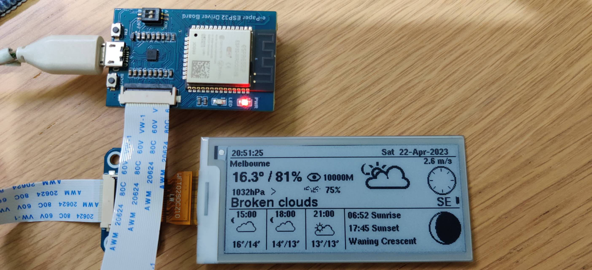

# Waveshare e-Paper ESP32 Driver Board

This directory contains the port to the
[Waveshare e-Paper ESP32 Driver Board](https://www.waveshare.net/shop/e-Paper-ESP32-Driver-Board.htm), which incorporates an ESP32 and a 2.9" 296x128 e-ink display.

This port was built using the Arduinio IDE, with the following settings for the board:

- Board: Waveshare e-Paper ESP32 Driver Board
- e-Paper Display: WFT0290CZ10
